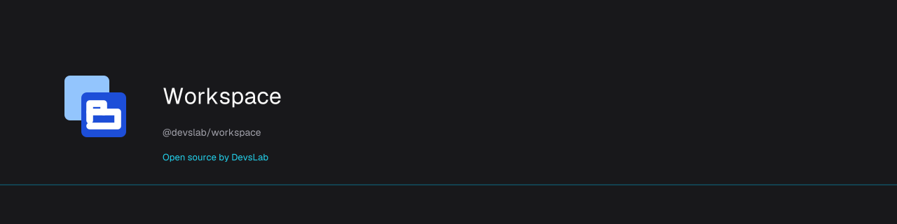

# Workspace

<p align="center">
  <a href="https://devslab.kr/brand/open-source/"></a>
</p>

<!-- publisher:start -->
Open source by [데브스랩(DevsLab)](https://devslab.kr/).
<!-- publisher:end -->

[](https://www.npmjs.com/package/@devslab/workspace)
[](https://github.com/devslab-kr/workspace/actions/workflows/verify.yml)

[](./LICENSE)

**English** · [한국어](README.ko.md) · [Documentation](docs/README.md) · [OSS brand guide](https://devslab.kr/brand/open-source/)

Retained work tabs, scoped shortcuts and an open-screen switcher. A framework-independent core with native Solid, React, Vue and Svelte adapters. Your pages keep their own forms, data, router, authorization and subscriptions.

Opening a registered screen creates its tab. The open-screen switcher is included; you supply the screen components and keep their business logic. Workspace 0.1.1 and later use Apache-2.0; the published 0.1.0 retains its original MIT license. DDS is a separate source-available design system.

## Install

```sh
npm install @devslab/workspace
# Install peers for the adapter you use, for example Solid:
npm install solid-js @ark-ui/solid@5.39.3
```

## Usage

```tsx
import { Workspace } from '@devslab/workspace/solid';
import '@devslab/workspace/style.css'; // optional

const screens = [
  { id: 'orders', title: 'Orders', component: OrdersPage },
  { id: 'customers', title: 'Customers', component: CustomersPage },
];
<Workspace screens={screens} defaultScreen="orders" />;
```

Only visited pages mount. Switching retains them behind `hidden` and `inert`; closing disposes the instance. A later open creates a fresh instance. Maximum nine tabs by default; stable slot numbers keep Alt+1–9 consistent. Alt+Q opens the switcher. Tabs use manual keyboard activation: arrows move focus; Enter/Space selects, Delete closes. Mobile supports every command through buttons.

The root and `./core` exports contain no framework runtime. Install only the optional peers used by your adapter:

| Import | Required peer packages |
| --- | --- |
| `@devslab/workspace` | none |
| `@devslab/workspace/solid` | `solid-js`, `@ark-ui/solid` |
| `@devslab/workspace/react` | `react`, `react-dom`, `@ark-ui/react` |
| `@devslab/workspace/vue` | `vue`, `@ark-ui/vue` |
| `@devslab/workspace/svelte` | `svelte` ≥5.29, `@ark-ui/svelte` |

Ark UI implements accessible interaction internally. Workspace callbacks return our values and results, not Ark details objects. Ark versions are pinned in the manifest; the Svelte adapter uses its independently versioned Ark package.

## Existing menus and guards

```ts
import { createWorkspace } from '@devslab/workspace';
const controller = createWorkspace({
  screens: [{ id: 'orders', title: 'Orders' }],
  beforeActivate: id => routerAuthorizeAndNavigate(id),
  beforeClose: id => confirmDiscardIfDirty(id),
});
await controller.open('orders');
// <Workspace controller={controller} screens={presentationScreens} menu={false} />
```

Use `useWorkspace().open(id)` inside your existing menu. Pass a controller only when the app needs external access. Controller mode and standalone options are mutually exclusive, and presentation IDs must match. The screen registry is construction-time; remount for a different registry or app identity.

Commands: `open`, `select` (already-open tabs only), `close`, `showSwitcher`, `hideSwitcher`, `reset`. Transitions return `ok`, `unknown`, `limit`, `denied`, `cancelled` or `stale`; thrown guard errors reject without changing the selected page. Only the latest valid transition commits. `reset()` immediately discards all work and invalidates pending guards: use it for logout/company changes. It bypasses dirty-close confirmation deliberately.

## Styling and composition

CSS is optional. Theme through `--ws-*` variables, `classNames`, content `slots`, or `unstyled`. Mechanical visibility and inactive-page focus exclusion work without CSS. Slots change labels/content while preserving accessible buttons. Headless parts provide control over layout:

For DDS styling, load your licensed DDS tokens and `@devslab/workspace/style.css`, then `@devslab/workspace/dds.css`. The optional mapping references DDS variables without bundling DDS assets. Set theme variables on `:root` (or both the workspace and switcher classes) so body-portalled dialogs inherit them. Supported tokens include `--ws-text`, `--ws-background`, `--ws-surface`, `--ws-border`, `--ws-accent`, `--ws-on-accent`, `--ws-focus`, `--ws-overlay`, `--ws-font`, `--ws-dialog-radius` and `--ws-dialog-shadow`.

```tsx
<WorkspaceProvider screens={screens} defaultScreen="orders" unstyled>
  <MyNavigation />
  <WorkspaceSwitcherTrigger />
  <WorkspaceTabList />
  <WorkspaceStatus />
  <WorkspacePanels />
  <WorkspaceSwitcher />
</WorkspaceProvider>
```

Compose `WorkspaceTab` and `WorkspaceCloseButton` for custom tab strips. Keep close controls outside the element with `role="tablist"`. `asChild` supports existing buttons with merged events/ref; `preventDefault()` cancels the Workspace action. Solid receives native attributes in its callback; React/Vue use their native Ark composition convention, Svelte uses a snippet and bindable `ref`.

Pages can optionally use `useWorkspacePage()` and `useActiveEffect()` to run app subscriptions only while active. React uses dependency arrays, Vue uses reactive refs, Solid uses accessors, Svelte uses getter/runes. Inactive page portals must consult page activity. Workspace never refetches, invalidates, clones page DOM, or transmits analytics. Supply static previews through `slots.preview` if useful.

Shortcuts skip editable elements, IME composition, repeat events and app dialogs. They apply only to events originating in the workspace. Disable with `shortcuts={false}` or configure `shortcuts={{switcher:'Ctrl+q',slots:['Alt+1','Alt+2']}}`. Set `dir` explicitly for SSR RTL; otherwise adapters inherit ambient direction after mount.

Default screens open after mounting, so default SSR output is empty. Preopen a request-local controller before SSR to render visited pages. Set `dir` explicitly for server RTL. No Next/Nuxt/SvelteKit integration is claimed.

`createHistoryWorkspace(options, browserHistory(window))` optionally connects initial URLs and browser back/forward. Supply `screenFromUrl` and `urlForScreen`; the returned `{controller,ready,dispose}` uses the same activation guard before showing a destination. Rejected back navigation restores the last accepted URL with replaceState, without adding an entry. App selection pushes only a changed URL. Disposal removes the history listener and resets the controller. The history adapter is synchronous; TanStack/React Router loaders and their async cancellation remain app-owned. A navigation guard bridge alone does not implement an async router integration.

## Verification

`npm run typecheck`, `npm run check:svelte`, `npm test`, `npm run build`, `npm run build:demo`, `npm run test:e2e`, then `node scripts/verify-package.mjs`. Svelte fixtures have separate browser/SSR runners under `tests/svelte/`. Package installation verification checks optional peers, installed exports and Solid browser hydration; source imports alone are insufficient. [Native React/Vue examples](docs/react-vue.md), [Svelte guide](src/svelte/README.md), [Korean guide](README.ko.md).

### Externally owned dynamic pages (Solid)

`RetainedPanels` supports an app whose guarded router synchronously registers authorized pages, including during SSR. The app keeps its own list, payloads, activity predicate and navigation commands; this component owns native page retention and inactive `hidden`/`inert` behavior.

```tsx
import { RetainedPanels } from '@devslab/workspace/solid';

<RetainedPanels
  items={authorizedPages()}
  active={page => routeReady() && page === activePage()}
  as="section"
  panelProps={page => ({ id: page.id, role: 'tabpanel', 'aria-labelledby': page.tabId })}
>
  {page => <PageContext.Provider value={page.activity}><Dynamic component={page.component} {...page.payload()} /></PageContext.Provider>}
</RetainedPanels>
```

Keep each item object stable to preserve its component owner. Removing or replacing that object disposes its page; selecting another item retains it. This is a separate integration surface from the fixed `Workspace` screen registry and supplies no router, authorization store or data cache. Gate page-owned portals with the app's activity context. Native attributes are forwarded through `panelProps`; activity always controls `hidden` and `inert`.
`controller.cancelPending()` invalidates outstanding activation/close guards without changing retained tabs, active page, or switcher state. The URL adapter calls it on every new URL intent, including unmapped, unknown, and tab-limited destinations, so an older guard cannot restore an obsolete URL. Switcher-only changes do not push history entries.

## Contributing

Issues and PRs are welcome. See [CONTRIBUTING.md](CONTRIBUTING.md) for setup, verification and documentation conventions. Release maintainers should follow [the OIDC release guide](docs/releasing.md).

## Family

- [kokey](https://github.com/devslab-kr/kokey) — keyboard-layout conversion for business forms.
- [numkey](https://github.com/devslab-kr/numkey) — caret-safe numeric inputs.
- [DDS](https://github.com/devslab-kr/dds) — a separately licensed design system, with an optional Workspace token mapping.
- [More open source from DevsLab](https://github.com/devslab-kr).

## License

[Apache-2.0](LICENSE) © [DevsLab](https://devslab.kr/).
